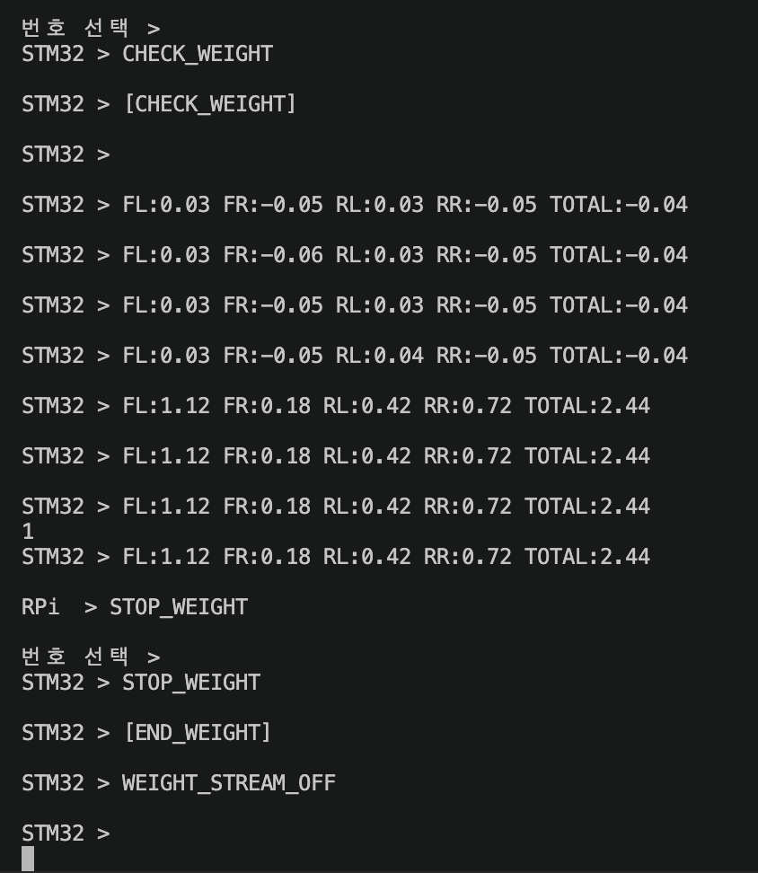
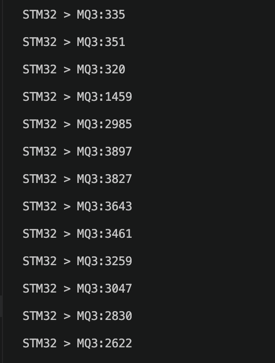

# 🍓 safe-kick-raspi

Safe Kick의 **라즈베리파이 AI·센서 서버**입니다.

FastAPI를 기반으로 다음 기능을 담당합니다.

- 킥보드 상태 조회
- 운행 세션 관리
- 실시간 모니터링(SSE)
- 킥보드 잠금·해제
- SQLite 센서 및 경고 로그 저장
- STM32 UART 통신
- 운전면허증 얼굴 등록
- 셀피 얼굴 인증
- 사용자별 얼굴 임베딩 저장
- 앱 인증 이후 STM32 안전 절차 자동 실행
- 주행 전 1인 탑승 확인 및 주행 중 2인 탑승 감시

## STM32 안전 절차

```text
Raspberry Pi 연결
  -> LOCK / LOCK_OK
  -> 앱 QR·회원·얼굴 인증 완료 대기
  -> CHECK_MQ3
  -> 음주 검사 통과
  -> 무게 측정 시작 이벤트 대기
  -> CHECK_WEIGHT
  -> 최근 3회 무게가 20~100kg, 편차 5kg 이내인지 확인
  -> UNLOCK / UNLOCK_OK
  -> 주행 중 무게 감시
  -> 110kg 이상 4초 지속: BUZZ_ON
  -> 추가 10초 지속: LOCK
```

`/unlock` 직접 호출은 기본적으로 차단됩니다. 하드웨어 테스트에서만
`ALLOW_MANUAL_UNLOCK=true`를 설정해 사용합니다. UART 장비 없이 API 흐름을
시험할 때는 기본값인 `USE_UART_MOCK=true`를 사용하고, 실제 연결 시
`USE_UART_MOCK=false`와 `SERIAL_PORT=/dev/serial0`을 설정합니다.

## 앱 연동 및 포트 설정

### 개발 PC에서 UART mock으로 실행

개발 PC에서 8000 포트를 다른 프로세스가 사용 중이면 8001 포트로 실행할 수
있습니다. `.env`에서 얼굴 API를 끄고 UART와 STM32 응답을 mock으로 설정합니다.

```env
ENABLE_FACE_API=false
ENABLE_TEST_API=true
USE_UART_MOCK=true
```

```bash
cd /home/jaywjd/project/safe-kick-raspi

./venv/bin/python -m uvicorn app.main:app \
  --host 127.0.0.1 \
  --port 8001
```

이 구성의 로컬 API 주소는 `http://127.0.0.1:8001`입니다. `127.0.0.1`로
실행한 서버에는 같은 PC에서만 접근할 수 있으므로 실제 휴대폰 앱 연동용으로는
사용할 수 없습니다.

### 실제 Raspberry Pi와 STM32로 실행

실제 장비에서는 외부 기기가 접근할 수 있도록 `0.0.0.0`에 바인딩하고,
앱의 기본 설정과 동일한 8000 포트를 사용합니다.

```bash
cd /home/jaywjd/project/safe-kick-raspi

./venv/bin/python -m uvicorn app.main:app \
  --host 0.0.0.0 \
  --port 8000
```

실행 설정은 프로젝트 루트의 `.env`에서 관리합니다. 실제 STM32 연결 시:

```env
ENABLE_FACE_API=true
ENABLE_TEST_API=false
ALLOW_MANUAL_UNLOCK=false
USE_UART_MOCK=false
SERIAL_PORT=/dev/serial0
BAUD_RATE=115200
```

처음 설정할 때는 `.env.example`을 복사한 뒤 장비 환경에 맞게 수정합니다.

```bash
cp .env.example .env
```

`.env`는 Git에서 제외되며, `.env.example`만 설정 템플릿으로 공유합니다.

Safe Kick 앱의 `.env`에는 실제 Raspberry Pi 주소를 설정해야 합니다.

```env
EXPO_PUBLIC_RASPI_IP=100.72.72.77
EXPO_PUBLIC_RASPI_API_BASE=http://100.72.72.77:8000
```

IP 주소와 포트는 실제 실행 중인 Raspberry Pi 서버와 반드시 일치해야 합니다.
주소를 변경한 뒤에는 Expo 개발 서버를 재시작해야 새 환경변수가 앱 번들에
반영됩니다.

연결 확인에는 별도 `/health` 경로가 아니라 다음 API를 사용합니다.

```bash
curl http://100.72.72.77:8000/status
```

정상 응답에서 `stm32_connected`, `safety_state`, `is_locked` 값을 확인합니다.
안전점검 중 음주 검사가 통과해 `safety_state`가 `waiting_rider`가 되면 앱은
`POST /session/weight-check`를 호출하며, 무게 검사와 잠금 해제가 완료되면
상태가 `monitoring`으로 바뀝니다.

## 백엔드 연동 전 테스트

얼굴 인식과 백엔드를 제외한 라즈베리파이·STM32 흐름만 시험할 수 있습니다.
테스트 전용 API는 `ENABLE_TEST_API=true`일 때만 등록됩니다.

```bash
python3 -m pip install -r requirements-test.txt
python3 -m uvicorn app.main:app --host 0.0.0.0 --port 8000
```

이 테스트를 실행할 때는 `.env`에서 `ENABLE_FACE_API=false`,
`ENABLE_TEST_API=true`, `USE_UART_MOCK=true`로 설정합니다.

다른 터미널에서 세션을 만들고 인증 완료 이벤트를 전달합니다.

```bash
curl -X POST http://127.0.0.1:8000/session/start \
  -H 'Content-Type: application/json' \
  -d '{"user_id":7,"kickboard_id":"KB-001"}'

curl -X POST http://127.0.0.1:8000/test/auth-complete \
  -H 'Content-Type: application/json' \
  -d '{"user_id":7}'

curl -X POST http://127.0.0.1:8000/test/weight-check \
  -H 'Content-Type: application/json' \
  -d '{"user_id":7}'

curl http://127.0.0.1:8000/status
```

실제 STM32 테스트에서는 `.env`의 `USE_UART_MOCK=false`,
`SERIAL_PORT=/dev/serial0` 설정을 사용합니다.

---

# 📁 폴더 구조

```text
safe-kick-raspi/
│
├── app/
│   ├── main.py                       # FastAPI 앱 진입점
│   ├── db.py                         # SQLite 연결 및 테이블 초기화
│   ├── state.py                      # 현재 세션 및 장치 상태 관리
│   │
│   ├── routes/
│   │   ├── status.py                 # 킥보드 현재 상태 조회
│   │   ├── session.py                # 운행 세션 시작·종료·요약·SSE
│   │   ├── lock.py                   # 킥보드 잠금·해제
│   │   └── face.py                   # 면허증 얼굴 등록 및 셀피 인증
│   │
│   ├── services/
│   │   ├── session_service.py        # 운행 세션 처리
│   │   ├── lock_service.py           # 잠금·해제 처리
│   │   ├── log_service.py            # 센서 및 경고 로그 저장
│   │   ├── uart_service.py           # STM32 UART 통신
│   │   └── face_service.py           # InsightFace 얼굴 검출·비교
│   │
│   ├── safety/                        # STM32 프로토콜 및 안전 판단 상태 머신
│   │
│   ├── managers/
│   │   └── session_manager.py        # 세션 상태 및 얼굴 점수 관리
│   │
│   ├── constants/
│   │   └── uart_commands.py          # STM32 UART 명령 상수
│   │
│   └── database/
│       └── safe_kick.db              # SQLite 데이터베이스
│
├── db/
│   └── users/
│       └── {user_id}/
│           └── license_embedding.npy # 사용자별 면허증 얼굴 임베딩
│
├── scripts/
│   └── test_db.py
│
├── requirements.txt
├── config.toml                        # UART·음주·탑승 판단 기준값
├── .gitignore
└── README.md
```

> 실제 프로젝트에서 라우터 폴더명이 `routers`라면 위 구조의 `routes`를 `routers`로 읽으면 됩니다.

---

# 🧩 시스템 역할

Safe Kick은 프론트엔드, Node.js 백엔드, 라즈베리파이 서버로 역할이 분리되어 있습니다.

```text
React Native 앱
├─ 회원가입·로그인 요청
│      ↓
│  Node.js 백엔드
│  └─ 사용자 계정, 면허 번호, 만료일, JWT 관리
│
└─ 면허증·셀피 이미지 전송
       ↓
   Raspberry Pi FastAPI
   └─ 얼굴 검출, 임베딩 저장, 동일인 비교
```

## 이미지 처리 원칙

- 면허증 원본 이미지는 Node.js 백엔드에 저장하지 않습니다.
- 프론트엔드는 면허증 이미지를 Base64 문자열로 변환하여 Raspberry Pi로 직접 전송합니다.
- Raspberry Pi는 원본 이미지 대신 얼굴 특징값인 임베딩을 저장합니다.
- 사용자별 임베딩은 다음 경로에 저장됩니다.

```text
db/users/{user_id}/license_embedding.npy
```

---

# ✅ 현재 구현된 API

## Status

```http
GET /status
```

현재 세션, 잠금 상태, 경고 상태 등을 조회합니다.

---

## Session

```http
POST /session/start
GET /session/stream
POST /session/end
GET /session/summary?session_id={id}
```

### 주요 기능

- 운행 세션 시작
- 운행 세션 종료
- 현재 센서 상태 SSE 전송
- 운행 요약 조회
- 경고 횟수 및 경고 사유 관리

---

## Lock

```http
POST /lock
POST /unlock
```

### 주요 기능

- 이상 상태 발생 시 킥보드 잠금
- 정상 상태 복구 후 잠금 해제
- 잠금 사유 및 상태 변경
- SSE를 통한 프론트 실시간 반영

---

## Face

### 면허증 얼굴 등록

```http
POST /face/register
```

요청:

```json
{
  "user_id": 1,
  "image": "data:image/jpeg;base64,/9j/4AAQ..."
}
```

처리 과정:

```text
면허증 Base64 이미지 수신
        ↓
OpenCV 이미지 디코딩
        ↓
InsightFace 얼굴 검출
        ↓
가장 큰 얼굴 선택
        ↓
얼굴 임베딩 추출
        ↓
사용자별 .npy 파일 저장
```

등록 성공 응답:

```json
{
  "status": "success",
  "data": {
    "registered": true,
    "user_id": 1,
    "reason": "success"
  },
  "message": "면허증 얼굴 등록이 완료되었습니다."
}
```

얼굴 검출 실패 응답:

```json
{
  "status": "error",
  "data": {
    "registered": false,
    "user_id": 1,
    "reason": "face_not_detected"
  },
  "message": "면허증에서 얼굴을 인식하지 못했습니다."
}
```

잘못된 이미지 응답:

```json
{
  "status": "error",
  "data": {
    "registered": false,
    "user_id": 1,
    "reason": "invalid_image"
  },
  "message": "면허증 이미지가 올바르지 않습니다."
}
```

프론트엔드는 `data.registered`가 `false`이면 로그인을 진행하지 않고 면허증 재촬영 화면으로 이동해야 합니다.

---

### 셀피 얼굴 인증

```http
POST /face/verify
```

요청:

```json
{
  "user_id": 1,
  "image": "data:image/jpeg;base64,/9j/4AAQ..."
}
```

처리 과정:

```text
현재 셀피 이미지 수신
        ↓
셀피 얼굴 임베딩 추출
        ↓
사용자별 면허증 임베딩 로드
        ↓
코사인 유사도 계산
        ↓
임계값 기준 동일인 판정
```

인증 성공 응답:

```json
{
  "status": "success",
  "data": {
    "match": true,
    "confidence": 0.72,
    "face_vector": [],
    "reason": "success"
  },
  "message": "얼굴 인증이 완료되었습니다."
}
```

인증 실패 응답:

```json
{
  "status": "error",
  "data": {
    "match": false,
    "confidence": 0.31,
    "face_vector": [],
    "reason": "not_matched"
  },
  "message": "얼굴 인증에 실패했습니다."
}
```

이미지에서 얼굴을 찾지 못한 경우:

```json
{
  "status": "error",
  "data": {
    "match": false,
    "confidence": 0.0,
    "face_vector": [],
    "reason": "face_not_detected"
  },
  "message": "얼굴 인증에 실패했습니다."
}
```

등록된 사용자 임베딩이 없는 경우:

```json
{
  "status": "error",
  "data": {
    "match": false,
    "confidence": 0.0,
    "face_vector": [],
    "reason": "registered_embedding_not_found"
  },
  "message": "얼굴 인증에 실패했습니다."
}
```

얼굴 인증에 성공하면 유사도 점수가 `SessionManager`에 저장됩니다.

---

# 🤖 얼굴 인식 설정

현재 얼굴 인식 설정은 다음과 같습니다.

```python
FACE_MODEL_NAME = "buffalo_sc"
FACE_PROVIDER = ["CPUExecutionProvider"]
FACE_DET_SIZE = (320, 320)
REGISTERED_MATCH_THRESHOLD = 0.5
```

## 판정 기준

```text
유사도 0.5 이상
→ 동일인 인증 성공

유사도 0.5 미만
→ 동일인 인증 실패
```

## 얼굴이 여러 개 검출된 경우

이미지에서 여러 얼굴이 검출되면 가장 큰 얼굴을 선택합니다.

```python
face = max(
    faces,
    key=lambda f: (
        (f.bbox[2] - f.bbox[0]) *
        (f.bbox[3] - f.bbox[1])
    )
)
```

---

# 🗄 SQLite 테이블

## sessions

```text
id
kickboard_id
user_id
started_at
ended_at
status
warning_count
```

## sensor_logs

```text
id
session_id
face_score
weight
gas
created_at
```

## warning_logs

```text
id
session_id
warning_type
created_at
```

---

# 🔌 UART 통신

`uart_service.py`는 Mock과 실제 STM32 통신을 전환할 수 있는 구조입니다.

## Mock 모드

```env
USE_UART_MOCK=true
SERIAL_PORT=/dev/serial0
BAUD_RATE=115200
```

## 실제 STM32 연결

```env
USE_UART_MOCK=false
SERIAL_PORT=/dev/serial0
BAUD_RATE=115200
```

## 통신 대상

```text
Raspberry Pi
    ↕ UART 115200 8N1
STM32 Nucleo-F411RE
```

STM32는 MQ-3 알코올 센서, 무게 센서, 릴레이, LED, 부저 등의 하드웨어를 제어합니다.

## `kickserial` 간단 설정

프로젝트 경로가 `~/safe-kick-raspi-team`인 경우 다음 설정만 추가합니다.

`~/.safe-kick-aliases`:

```bash
unalias kickserial 2>/dev/null

kickserial() {
    cd ~/safe-kick-raspi-team || return
    .venv/bin/python tools/stm32_menu.py --port /dev/serial/by-id/usb-STMicroelectronics_STM32_STLink_066FFF505567494867085224-if01
}
```

`~/.bashrc` 맨 아래:

```bash
source ~/.safe-kick-aliases
```

```bash
source ~/.bashrc
kickserial
```

## STM32 하드웨어 개별 테스트

> **안전 주의:** Uvicorn 서버와 `kickserial`은 같은 UART 포트를 동시에 사용할
> 수 없습니다. 모터 시험 전에는 킥보드를 고정하고 구동 바퀴를 지면에서
> 띄워야 합니다.

실제 터미널 캡처를 포함한 원본 테스트 기록은
[Notion 하드웨어 개별 테스트](https://www.notion.so/3c3e8d3fa9438151a82ce8506d277b61)에서
확인할 수 있습니다.

### 1. 최신 테스트 메뉴 받기

```bash
cd ~/safe-kick-raspi-team
git switch pjb-add-motor
git pull origin pjb-add-motor
```

### 2. 서버 종료 및 UART 점유 확인

서버가 실행 중이면 Swagger에서 `POST /test/motor/lock`과
`POST /session/end`를 실행한 뒤 서버 터미널에서 `Ctrl+C`를 누릅니다.
8000 포트가 비었는지 확인합니다.

```bash
ss -ltnp | grep ":8000"
```

출력이 없으면 서버가 종료된 상태입니다.

### 3. 번호 메뉴 실행

```bash
kickserial
```

| 입력 | 기능 | STM32 UART 명령 |
|---:|---|---|
| `0` | 무게 측정 시작 | `CHECK_WEIGHT` |
| `1` | 무게 측정 중지 | `STOP_WEIGHT` |
| `2` | MQ-3 원시값 연속 측정 시작 | `TEST_MQ3` |
| `3` | MQ-3 원시값 연속 측정 중지 | `STOP_TEST_MQ3` |
| `4` | MQ-3 음주 판정 시퀀스 실행 | `CHECK_MQ3` |
| `5` | 모터 상태 확인 | `MOTOR_STATE` |
| `6` | 모터 잠금 및 릴레이 차단 | `LOCK` |
| `7` | 모터 잠금 해제 및 점진 가속 | `UNLOCK` |
| `8` | 부저 켜기 및 모터 감속 | `BUZZ_ON` |
| `9` | 부저 끄기 및 모터 속도 복구 | `BUZZ_OFF` |
| `h` | 메뉴 다시 표시 | - |
| `q` | UART 메뉴 종료 | - |

STM32 RESET 버튼을 누른 후 발판을 완전히 비워 둡니다. 다음 메시지가 나올 때까지
로드셀이나 발판을 건드리지 않습니다.

```text
Tare...
READY
```

### 4. 로드셀 측정

`0`을 입력하면 약 1초 간격으로 네 채널과 합산 무게가 출력됩니다.

```text
FL:0.01 FR:-0.02 RL:0.00 RR:0.01 TOTAL:0.00
```

1. 빈 발판에서 각 채널이 약 -1~1kg, `TOTAL`이 약 -2~2kg인지 확인합니다.
2. 2.5kg 아령을 FL, FR, RL, RR 위치에 차례로 올립니다.
3. 각 위치의 채널이 양수로 증가하고 `TOTAL`이 약 2.5kg인지 확인합니다.
4. 아령을 내렸을 때 `TOTAL`이 0kg 근처로 돌아오는지 확인합니다.
5. `1`을 입력해 연속 측정을 중지합니다.

정상 종료 응답 예시:

```text
[END_WEIGHT]
WEIGHT_STREAM_OFF
```

실제 시험에서 빈 발판은 `TOTAL:-0.04kg`, 2.5kg 아령은 `TOTAL:2.44kg`로
측정됐으며, 하중 제거 후 0kg 근처 복귀와 `WEIGHT_STREAM_OFF`까지 확인했습니다.



### 5. MQ-3 측정

원시값 연속 확인은 `2`를 입력합니다.

```text
MQ3_STREAM_ON
MQ3:335
MQ3:351
MQ3:320
MQ3:1459
MQ3:2985
MQ3:3897
```

`3`을 입력하면 원시값 연속 측정이 중지됩니다. 실제 음주 판정용 기준값 및 표본
측정은 `4`를 입력합니다.

```text
[CHECK_MQ3]
MQ3_BASELINE:67
MQ3:68
MQ3:70
[END_MQ3]
```

실제 시험에서는 낮은 원시값 구간에서 센서 반응 후 최대 `3897`까지 상승하는
연속 표본을 확인했습니다.



### 6. 모터, L298N, 릴레이 및 부저 시험

모터 시험 전 구동 바퀴가 지면에 닿지 않았는지 다시 확인합니다.

1. `6`을 입력해 잠금 상태로 시작합니다.
2. `5`를 입력해 `MOTOR:LOCKED SPEED:0`인지 확인합니다.
3. `7`을 입력해 잠금을 해제하고 점진 가속을 확인합니다.
4. 약 4초 후 `5`를 입력해 `MOTOR:UNLOCKED SPEED:70`인지 확인합니다.
5. `8`을 입력해 부저와 감속을 확인합니다.
6. 약 2초 후 `5`를 입력해 `MOTOR:UNLOCKED SPEED:30`인지 확인합니다.
7. `9`를 입력해 부저 정지와 속도 복구를 확인합니다.
8. 시험이 끝나면 반드시 `6`을 입력해 릴레이와 모터 출력을 차단합니다.

실제 테스트 결과:

```text
5 -> MOTOR:LOCKED SPEED:0
7 -> UNLOCK_OK
5 -> MOTOR:UNLOCKED SPEED:67
5 -> MOTOR:UNLOCKED SPEED:70
8 -> BUZZ_ON
5 -> MOTOR:UNLOCKED SPEED:30
9 -> BUZZ_OFF
5 -> MOTOR:UNLOCKED SPEED:70
6 -> LOCK_OK
```

점진 가속 중 속도 67을 거쳐 목표 속도 70에 도달했고, 경고 시 30으로 감속한 뒤
경고 해제 시 70으로 복구되었습니다. 마지막 `LOCK` 응답까지 정상 확인했습니다.

### 7. 안전 종료

연속 측정 중이면 `1`과 `3`으로 스트림을 중지하고, `6`으로 모터를 잠근 다음
`q`를 입력합니다.

```text
1  -> STOP_WEIGHT
3  -> STOP_TEST_MQ3
6  -> LOCK
q  -> UART 메뉴 종료
```

### 문제 해결

| 증상 | 확인 사항 |
|---|---|
| UART를 열 수 없음 | Uvicorn, miniterm, CubeIDE Serial Terminal이 포트를 점유하는지 확인 |
| STM32 응답 없음 | ST-LINK USB 연결, 115200 baud, 펌웨어 업로드 상태 확인 |
| 로드셀 채널이 계속 0.00 | 해당 HX711의 DT/SCK, 전원, 로드셀 배선과 하중 전달 상태 확인 |
| 하중을 올리면 음수 | 로드셀 A+/A- 또는 설치 방향 확인 |
| 값은 안정적이지만 실제 무게와 다름 | 채널별 scale 값 재보정 |
| `kickserial`을 찾을 수 없음 | `source ~/.bashrc` 실행 후 `type kickserial` 확인 |

---

# 📡 실시간 모니터링 흐름

```text
STM32 Sensor / Mock Data
        ↓
UART Service
        ↓
SessionManager
        ↓
SQLite 로그 저장
        ↓
SSE /session/stream
        ↓
React Native 모니터링 화면
```

SSE는 다음 상태가 변경될 때 프론트에 실시간 정보를 전달합니다.

- 잠금 상태
- 장치 상태
- 경고 사유
- 2인 탑승 여부
- 음주 감지 여부

---

# 🌐 네트워크 연결

현재 개발 환경에서는 Tailscale을 사용하여 스마트폰, Node.js 서버, Raspberry Pi를 연결할 수 있습니다.

```text
스마트폰
├─ Tailscale → Node.js 백엔드
└─ Tailscale → Raspberry Pi FastAPI
```

프론트엔드 예시:

```ts
export const API_BASE = "http://Node서버-Tailscale-IP";

export const RASPI_IP = "RaspberryPi-Tailscale-IP";
export const RASPI_API_BASE =
  `http://${RASPI_IP}:8000`;
```

핸드폰 IP는 설정하지 않습니다. 핸드폰은 API 요청을 보내는 클라이언트이기 때문입니다.

---

# ▶️ 실행 방법

## 1. 프로젝트 이동

```bash
cd safe-kick-raspi
```

## 2. 가상환경 생성

### Raspberry Pi 또는 Linux

```bash
python3 -m venv venv
source venv/bin/activate
```

### Windows 테스트 환경

```powershell
python -m venv venv
.\venv\Scripts\Activate.ps1
```

## 3. 패키지 설치

```bash
pip install -r requirements.txt
```

## 4. 서버 실행

```bash
uvicorn app.main:app --host 0.0.0.0 --port 8000
```

`0.0.0.0`은 모든 네트워크 인터페이스에서 요청을 받기 위한 서버 바인딩 주소입니다.

브라우저 접속 주소로는 사용하지 않습니다.

## 5. API 문서 확인

같은 장치에서 확인:

```text
http://localhost:8000/docs
```

다른 스마트폰 또는 컴퓨터에서 확인:

```text
http://라즈베리파이IP:8000/docs
```

Tailscale 사용 시:

```text
http://라즈베리파이-Tailscale-IP:8000/docs
```

---

# 🧪 얼굴 등록 테스트

Swagger UI에서 다음 API를 선택합니다.

```http
POST /face/register
```

테스트 요청:

```json
{
  "user_id": 1,
  "image": "Base64 이미지 문자열"
}
```

등록 성공 후 파일 확인:

```bash
ls db/users/1
```

예상 결과:

```text
license_embedding.npy
```

---

# 🧪 얼굴 인증 테스트

Swagger UI에서 다음 API를 선택합니다.

```http
POST /face/verify
```

테스트 요청:

```json
{
  "user_id": 1,
  "image": "현재 셀피 Base64 문자열"
}
```

응답의 다음 값을 확인합니다.

```text
data.match
data.confidence
data.reason
```

---

# ⚠️ 주요 실패 사유

| reason | 의미 |
|---|---|
| `success` | 얼굴 등록 또는 인증 성공 |
| `invalid_image` | Base64 이미지 디코딩 실패 |
| `face_not_detected` | 이미지에서 얼굴을 찾지 못함 |
| `not_matched` | 얼굴은 검출됐지만 등록 사용자와 다름 |
| `registered_embedding_not_found` | 해당 사용자의 등록 임베딩 파일이 없음 |

---

# 🔐 개인정보 처리 방향

현재 구조에서는 얼굴 관련 정보를 다음과 같이 처리합니다.

```text
면허증 원본 이미지
→ 프론트에서 Raspberry Pi로 전송
→ 얼굴 임베딩 추출 후 요청 처리 종료

저장 데이터
→ 원본 이미지가 아닌 얼굴 임베딩 파일
```

Node.js 백엔드에는 다음 정보만 저장합니다.

- 사용자 계정
- 이름
- 이메일
- 비밀번호 해시
- 면허 번호
- 면허 만료일

라즈베리파이에는 사용자별 얼굴 임베딩을 저장합니다.

---

# 🔜 다음 구현 및 개선 예정

- STM32 UART 실제 하드웨어 통합 검증
- MQ-3 알코올 센서 측정값 연동
- 무게 센서를 이용한 2인 탑승 감지
- 얼굴 등록 실패 시 프론트 면허증 재촬영 흐름 적용
- 얼굴 인증 실패 횟수 및 재시도 제한
- 사용자 탈퇴 시 얼굴 임베딩 삭제
- 임베딩 파일 암호화 또는 접근 권한 강화
- Node.js 서버와 운행 종료 요약 연동
- 센서 및 얼굴 인증 통합 테스트
